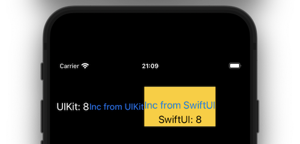

# MVVM UIKit to SwiftUI and vice versa
### Requires iOS 17 and Swift 5.9

The most basic sample code I could come up to show a UIKit-starting App (without any Storyboard) interact with a SwiftUI view while listening to an `@Observable` ViewModel using [`withObservationTracking`](https://github.com/swiftlang/swift-evolution/blob/main/proposals/0395-observability.md).

Not supposed to be pretty ;-) but has all the following in a single `App.swift`:

- `AppDelegate` to start the App (had to use `Info.plist`).
- `ViewController` Displaying a simple `UIStackView` containing:
	- A `UILabel` to display the `count`.
	- A `UIButton` to trigger the `increment` method from the `ViewModel`.
	- The `ContentView` for displaying the **SwiftUI** part.
- `ViewModel` has a `count` (`Int`) setup `private(set)` and `increment` is called from both **SwiftUI** and **UIKit**.
- `ContentView` gets the `ViewModel` instance from **UIKit** and then simply reference the `count` in the `Text` and calls the `increment` from the `Button`
- `RepresentedView` allows to use the `#Preview` to preview the whole App (including **UIKit**).